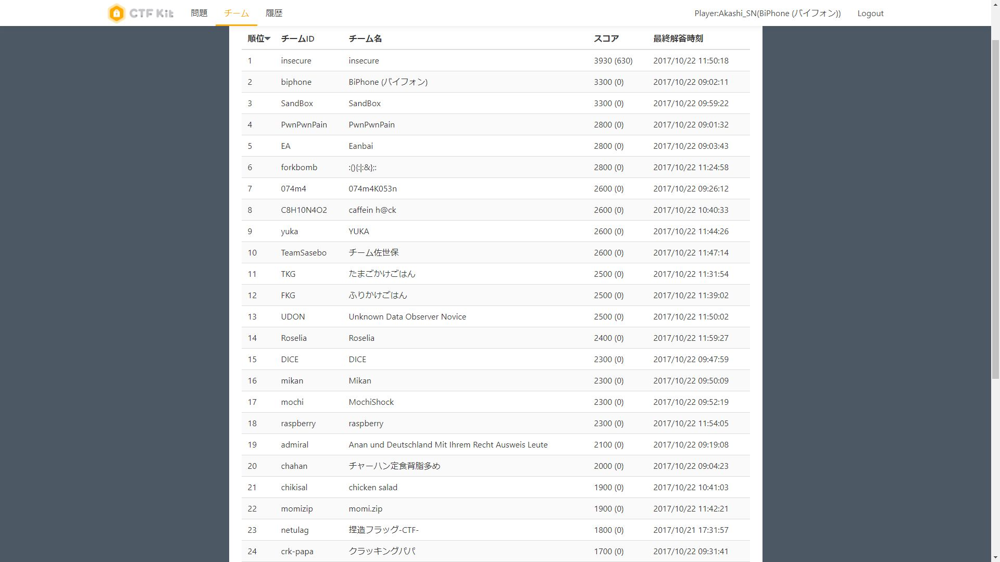
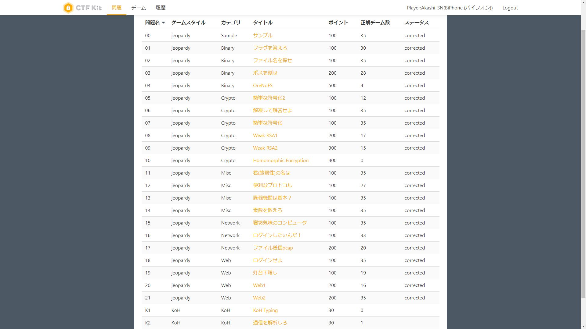

# kosensc2017

高専セキュリティコンテスト2017のWriteUpです

**解答者が[@Akashi_SN](https://twitter.com/Akashi_SN)以外の問題のWriteUpはコンテスト終了後に解き直してるものです**

チーム[BiPhone](https://ctftime.org/team/21255)として[@sei0o](https://twitter.com/sei0o)、[@yfba_](https://twitter.com/yfba_)、[@Snow_Poijio](https://twitter.com/Snow_Poijio)と出場しました。

チームメイトのWriteUps

- [@sei0o](https://twitter.com/sei0o) : [高専セキュコンに出た #SCKOSEN](http://sei0o.hateblo.jp/entry/2017/10/22/204314)
- [@yfba_](https://twitter.com/yfba_) : [17'高専セキュリティコンテストに参加した[write-up]](http://ecasd-qina.hatenablog.com/entry/20171023/1508722329)

2位でした！！！



解いた問題




|*|Category|Title|Point(Bonus)|Status|WriteUp|Solver(Bonus)|
|-|:------:|:---:|:---:|:----:|:-----:|:----:|
|0|Sample|サンプル|100|✓|[✓](q0/q0.md)|[@yfba_](https://twitter.com/yfba_)|
|1|Binary|フラグを答えろ|100|✓|[✓](q1/q2.md)|[@sei0o](https://twitter.com/sei0o)|
|2|Binary|ファイル名を探せ|100|✓|[✓](q2/q2.md)|[@Snow_Poijio](https://twitter.com/Snow_Poijio)|
|3|Binary|ボスを倒せ|200|✓|[✓](q3/q3.md)|[@yfba_](https://twitter.com/yfba_)|
|4|Binary|OreNoFS|500|✓|[✓](q4/q4.md)|[@sei0o](https://twitter.com/sei0o)|
|5|Crypto|簡単な符号化2|100|✓|[✓](q5/q5.md)|[@Akashi_SN](https://twitter.com/Akashi_SN)|
|6|Crypto|解凍して解答せよ|100|✓|[✓](q6/q6.md)|[@Snow_Poijio](https://twitter.com/Snow_Poijio)|
|7|Crypto|簡単な符号化|100|✓|[✓](q7/q7.md)|[@Akashi_SN](https://twitter.com/Akashi_SN)|
|8|Crypto|Weak RSA1|200|✓|[✓](q8/q8.md)|[@Snow_Poijio](https://twitter.com/Snow_Poijio)|
|9|Crypto|Weak RSA2|300|✓|[✓](q9/q9.md)|[@yfba_](https://twitter.com/yfba_)|
|10|Crypto|Homomorphic Encryption|400|||-|
|11|Misc|君(脆弱性)の名は|100|✓|[✓](q11/q11.md)|[@sei0o](https://twitter.com/sei0o)|
|12|Misc|便利なプロトコル|100|✓|[✓](q12/q12.md)|[@Snow_Poijio](https://twitter.com/Snow_Poijio)|
|13|Misc|諜報機関は基本？|100|✓|[✓](q13/q13.md)|[@sei0o](https://twitter.com/sei0o)|
|14|Misc|素数を数えろ|100|✓|[✓](q14/q14.md)|[@yfba_](https://twitter.com/yfba_)|
|15|Network|寝坊気味のコンピュータ|100|✓|[✓](q15/q15.md)|[@Akashi_SN](https://twitter.com/Akashi_SN)|
|16|Network|ログインしたいんだ！|100|✓|[✓](q16/q16.md)|[@Akashi_SN](https://twitter.com/Akashi_SN)|
|17|Network|ファイル送信pcap|200|✓|[✓](q17/q17.md)|[@sei0o](https://twitter.com/sei0o)|
|18|Web|ログインせよ|100|✓|[✓](q18/q18.md)|[@Snow_Poijio](https://twitter.com/Snow_Poijio)|
|19|Web|ログインせよ|100|✓|[✓](q19/q19.md)|[@Snow_Poijio](https://twitter.com/Snow_Poijio)|
|20|Web|Web1|200|✓|[✓](q20/q20.md)|[@sei0o](https://twitter.com/sei0o)|
|21|Web|Web2|200|✓|[✓](q21/q21.md)|[@sei0o](https://twitter.com/sei0o)|
|22|KoH|KoH Typing|30(100)|||-|
|23|KoH|通信を解析しろ|30(100)|✓|[✓](q23/q23.md)|([@Akashi_SN](https://twitter.com/Akashi_SN))|


## 環境

```plain
$  uname -a
Linux XPS-13-9360 4.13.0-16-generic #19-Ubuntu SMP Wed Oct 11 18:35:14 UTC 2017 x86_64 x86_64 x86_64 GNU/Linux

$ lsb_release -a
No LSB modules are available.
Distributor ID: Ubuntu
Description:    Ubuntu 17.10
Release:    17.10
Codename:   artful

$ pyenv global 3.6.3

$  python -V
Python 3.6.3

$ pip -V
pip 9.0.1 from /home/user/.pyenv/versions/3.6.3/lib/python3.6/site-packages (python 3.6)

$ pyenv global 2.7.14

$ python -V
Python 2.7.14

$ pip -V
pip 9.0.1 from /home/user/.pyenv/versions/2.7.14/lib/python2.7/site-packages (python 2.7)
```

- Ubuntu 17.10
- Python 3.6.3 (pyenv)
- Python 2.7.14 (pyenv)
- pip 9.0.1 (pyenv)

こちらの環境で動作確認をしています