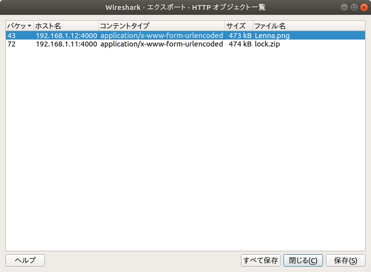

# ファイル送信pcap [Network / 200pt]

## Problem

これはファイルを送受信しているpcapです

[Problem File]

[file.pcap](file.pcap)

## Answer

解答者: [@sei0o](https://twitter.com/sei0o)

開くとファイルをやり取りしてるのがわかるのでとりあえずエクスポート



```bash
$ file Lenna.png lock.zip 
Lenna.png: PNG image data, 512 x 512, 8-bit/color RGB, non-interlaced
lock.zip:  Zip archive data, at least v2.0 to extract
$ zipinfo lock.zip 
Archive:  lock.zip
Zip file size: 474291 bytes, number of entries: 2
-rwxrwx---  3.0 unx   473831 BX defN 13-Oct-04 07:42 Lenna.png
-rwxrwx---  3.0 unx       17 TX stor 17-Oct-21 01:51 flag.txt
2 files, 473848 bytes uncompressed, 473923 bytes compressed:  0.0%
```

これは既知平文攻撃だとわかる

とりあえず`Lenna.png`を圧縮率0で`ZIP`圧縮してと

```bash
$ zip Lenna.png.zip Lenna.png -0
  adding: Lenna.png (stored 0%)
$  zipinfo Lenna.png.zip
Archive:  Lenna.png.zip
Zip file size: 473999 bytes, number of entries: 1
-rw-r--r--  3.0 unx   473831 bx stor 17-Oct-28 18:28 Lenna.png
1 file, 473831 bytes uncompressed, 473831 bytes compressed:  0.0%
```

よし

あとは`pkcrack`さんに任せた

>pkcrackの使い方は、

>　-C [暗号化されたzipファイル]

>　-c [暗号化されたzipファイルの中で平文がわかるファイル]

>　-P [平文のファイルが入っている暗号化されていないzip]

>　-p [平文のファイル]

>　-d [出力先（復号したzipファイルの名前）]


```plain
$ pkcrack -C lock.zip -c Lenna.png -P Lenna.png.zip -p Lenna.png -d unlock.zip
Files read. Starting stage 1 on Sat Oct 28 18:37:30 2017
Generating 1st generation of possible key2_473842 values...done.
Found 4194304 possible key2-values.
Now we're trying to reduce these...
(省略)
Done. Left with 89 possible Values. bestOffset is 464143.
Stage 1 completed. Starting stage 2 on Sat Oct 28 18:37:39 2017
Stage 2 completed. Starting zipdecrypt on Sat Oct 28 18:37:41 2017
No solutions found. You must have chosen the wrong plaintext.
Finished on Sat Oct 28 18:37:41 2017
```

あれ？

`No solutions found. You must have chosen the wrong plaintext.`？？

もう一度詳しく確認してみよう

```plain
$ zipdetails lock.zip 

00000 LOCAL HEADER #1       04034B50
00004 Extract Zip Spec      14 '2.0'
00005 Extract OS            00 'MS-DOS'
00006 General Purpose Flag  0009
      [Bit  0]              1 'Encryption'
      [Bits 1-2]            1 'Maximum Compression'
      [Bit  3]              1 'Streamed'
00008 Compression Method    0008 'Deflated'
0000A Last Mod Time         43443D5A 'Fri Oct  4 07:42:52 2013'
0000E CRC                   E3A729DC
00012 Compressed Length     00073B3E
00016 Uncompressed Length   00073AE7
0001A Filename Length       0009
0001C Extra Length          001C
0001E Filename              'Lenna.png'
00027 Extra ID #0001        5455 'UT: Extended Timestamp'
00029   Length              0009
0002B   Flags               '03 mod access'
0002C   Mod Time            524DF2EB 'Fri Oct  4 07:42:51 2013'
00030   Access Time         59EA29F5 'Sat Oct 21 01:53:09 2017'
00034 Extra ID #0002        7875 'ux: Unix Extra Type 3'
00036   Length              000B
00038   Version             01
00039   UID Size            04
0003A   UID                 00000000
0003E   GID Size            04
0003F   GID                 000003E7
00043 PAYLOAD

73B81 STREAMING DATA HEADER 08074B50
73B85 CRC                   E3A729DC
73B89 Compressed Length     00073B3E
73B8D Uncompressed Length   00073AE7

73B91 LOCAL HEADER #2       04034B50
73B95 Extract Zip Spec      0A '1.0'
73B96 Extract OS            00 'MS-DOS'
73B97 General Purpose Flag  0009
      [Bit  0]              1 'Encryption'
      [Bit  3]              1 'Streamed'
73B99 Compression Method    0000 'Stored'
73B9B Last Mod Time         4B550E6B 'Sat Oct 21 01:51:22 2017'
73B9F CRC                   AD0CDFB6
73BA3 Compressed Length     0000001D
73BA7 Uncompressed Length   00000011
73BAB Filename Length       0008
73BAD Extra Length          001C
73BAF Filename              'flag.txt'
73BB7 Extra ID #0001        5455 'UT: Extended Timestamp'
73BB9   Length              0009
73BBB   Flags               '03 mod access'
73BBC   Mod Time            59EA2989 'Sat Oct 21 01:51:21 2017'
73BC0   Access Time         59EA29F5 'Sat Oct 21 01:53:09 2017'
73BC4 Extra ID #0002        7875 'ux: Unix Extra Type 3'
73BC6   Length              000B
73BC8   Version             01
73BC9   UID Size            04
73BCA   UID                 00000000
73BCE   GID Size            04
73BCF   GID                 000003E7
73BD3 PAYLOAD               ......6..uuO......@.5..&-.?xz

73BF0 STREAMING DATA HEADER 08074B50
73BF4 CRC                   AD0CDFB6
73BF8 Compressed Length     0000001D
73BFC Uncompressed Length   00000011

73C00 CENTRAL HEADER #1     02014B50
73C04 Created Zip Spec      1E '3.0'
73C05 Created OS            03 'Unix'
73C06 Extract Zip Spec      14 '2.0'
73C07 Extract OS            00 'MS-DOS'
73C08 General Purpose Flag  0009
      [Bit  0]              1 'Encryption'
      [Bits 1-2]            1 'Maximum Compression'
      [Bit  3]              1 'Streamed'
73C0A Compression Method    0008 'Deflated'
73C0C Last Mod Time         43443D5A 'Fri Oct  4 07:42:52 2013'
73C10 CRC                   E3A729DC
73C14 Compressed Length     00073B3E
73C18 Uncompressed Length   00073AE7
73C1C Filename Length       0009
73C1E Extra Length          0018
73C20 Comment Length        0000
73C22 Disk Start            0000
73C24 Int File Attributes   0000
      [Bit 0]               0 'Binary Data'
73C26 Ext File Attributes   81F80000
73C2A Local Header Offset   00000000
73C2E Filename              'Lenna.png'
73C37 Extra ID #0001        5455 'UT: Extended Timestamp'
73C39   Length              0005
73C3B   Flags               '03 mod access'
73C3C   Mod Time            524DF2EB 'Fri Oct  4 07:42:51 2013'
73C40 Extra ID #0002        7875 'ux: Unix Extra Type 3'
73C42   Length              000B
73C44   Version             01
73C45   UID Size            04
73C46   UID                 00000000
73C4A   GID Size            04
73C4B   GID                 000003E7

73C4F CENTRAL HEADER #2     02014B50
73C53 Created Zip Spec      1E '3.0'
73C54 Created OS            03 'Unix'
73C55 Extract Zip Spec      0A '1.0'
73C56 Extract OS            00 'MS-DOS'
73C57 General Purpose Flag  0009
      [Bit  0]              1 'Encryption'
      [Bit  3]              1 'Streamed'
73C59 Compression Method    0000 'Stored'
73C5B Last Mod Time         4B550E6B 'Sat Oct 21 01:51:22 2017'
73C5F CRC                   AD0CDFB6
73C63 Compressed Length     0000001D
73C67 Uncompressed Length   00000011
73C6B Filename Length       0008
73C6D Extra Length          0018
73C6F Comment Length        0000
73C71 Disk Start            0000
73C73 Int File Attributes   0001
      [Bit 0]               1 Text Data
73C75 Ext File Attributes   81F80000
73C79 Local Header Offset   00073B91
73C7D Filename              'flag.txt'
73C85 Extra ID #0001        5455 'UT: Extended Timestamp'
73C87   Length              0005
73C89   Flags               '03 mod access'
73C8A   Mod Time            59EA2989 'Sat Oct 21 01:51:21 2017'
73C8E Extra ID #0002        7875 'ux: Unix Extra Type 3'
73C90   Length              000B
73C92   Version             01
73C93   UID Size            04
73C94   UID                 00000000
73C98   GID Size            04
73C99   GID                 000003E7

73C9D END CENTRAL HEADER    06054B50
73CA1 Number of this disk   0000
73CA3 Central Dir Disk no   0000
73CA5 Entries in this disk  0002
73CA7 Total Entries         0002
73CA9 Size of Central Dir   0000009D
73CAD Offset to Central Dir 00073C00
73CB1 Comment Length        0000
Done
```

`Compression Method    0008 'Deflated'`とあるように`'Lenna.png'`は圧縮方法が`Deflated`である

次に自分で圧縮した`Lenna.png.zip`を見てみる

```plain
$ zipdetails Lenna.png.zip 

00000 LOCAL HEADER #1       04034B50
00004 Extract Zip Spec      0A '1.0'
00005 Extract OS            00 'MS-DOS'
00006 General Purpose Flag  0000
00008 Compression Method    0000 'Stored'
0000A Last Mod Time         4B5C938A 'Sat Oct 28 18:28:20 2017'
0000E CRC                   E3A729DC
00012 Compressed Length     00073AE7
00016 Uncompressed Length   00073AE7
0001A Filename Length       0009
0001C Extra Length          001C
0001E Filename              'Lenna.png'
00027 Extra ID #0001        5455 'UT: Extended Timestamp'
00029   Length              0009
0002B   Flags               '03 mod access'
0002C   Mod Time            59F44DB4 'Sat Oct 28 18:28:20 2017'
00030   Access Time         59F44DB7 'Sat Oct 28 18:28:23 2017'
00034 Extra ID #0002        7875 'ux: Unix Extra Type 3'
00036   Length              000B
00038   Version             01
00039   UID Size            04
0003A   UID                 000003E8
0003E   GID Size            04
0003F   GID                 000003E8
00043 PAYLOAD

73B2A CENTRAL HEADER #1     02014B50
73B2E Created Zip Spec      1E '3.0'
73B2F Created OS            03 'Unix'
73B30 Extract Zip Spec      0A '1.0'
73B31 Extract OS            00 'MS-DOS'
73B32 General Purpose Flag  0000
73B34 Compression Method    0000 'Stored'
73B36 Last Mod Time         4B5C938A 'Sat Oct 28 18:28:20 2017'
73B3A CRC                   E3A729DC
73B3E Compressed Length     00073AE7
73B42 Uncompressed Length   00073AE7
73B46 Filename Length       0009
73B48 Extra Length          0018
73B4A Comment Length        0000
73B4C Disk Start            0000
73B4E Int File Attributes   0000
      [Bit 0]               0 'Binary Data'
73B50 Ext File Attributes   81A40000
73B54 Local Header Offset   00000000
73B58 Filename              'Lenna.png'
73B61 Extra ID #0001        5455 'UT: Extended Timestamp'
73B63   Length              0005
73B65   Flags               '03 mod access'
73B66   Mod Time            59F44DB4 'Sat Oct 28 18:28:20 2017'
73B6A Extra ID #0002        7875 'ux: Unix Extra Type 3'
73B6C   Length              000B
73B6E   Version             01
73B6F   UID Size            04
73B70   UID                 000003E8
73B74   GID Size            04
73B75   GID                 000003E8

73B79 END CENTRAL HEADER    06054B50
73B7D Number of this disk   0000
73B7F Central Dir Disk no   0000
73B81 Entries in this disk  0001
73B83 Total Entries         0001
73B85 Size of Central Dir   0000004F
73B89 Offset to Central Dir 00073B2A
73B8D Comment Length        0000
Done
```

こっちでは`Compression Method    0000 'Stored'`となっている

`Deflated`と`Stored`の違いってなんだ？

[ZIP (ファイルフォーマット) - 圧縮メソッド]("https://ja.wikipedia.org/wiki/ZIP_(%E3%83%95%E3%82%A1%E3%82%A4%E3%83%AB%E3%83%95%E3%82%A9%E3%83%BC%E3%83%9E%E3%83%83%E3%83%88)#.E5.9C.A7.E7.B8.AE.E3.83.A1.E3.82.BD.E3.83.83.E3.83.89")

> 現在のZIPファイルフォーマット仕様では次のメソッドの詳細が記載されている。

> stored（無圧縮）、Shrunk、Reduced（メソッド 1-4）、Imploded、Tokenizing、Deflated、Deflate64、BZIP2、LZMA (EFS)、WavPack、PPMd。

> 最も一般的な圧縮メソッドはDEFLATEでIETF RFC 1951に記載されている。

どうやら問題のZIPの方は`Deflate圧縮アルゴリズム`を使用して圧縮されていたようだが、自分で作成したZIPは`stored（無圧縮）`となっていたよう

圧縮する際に`-0`のオプションをつけると無圧縮になるそう

ZIPでは無圧縮と圧縮率0では違うものと扱うようなのでpkcrackが失敗したよう

今度はオプションをつけずに圧縮してみる

```plain
$ zip Lenna.png.zip Lenna.png                                                 
updating: Lenna.png (deflated 0%)
```

`deflated`となっているので良さそう

もう一度pkcrack

```plain
$ pkcrack -C lock.zip -c Lenna.png -P Lenna.png.zip -p Lenna.png -d unlock.zip
Files read. Starting stage 1 on Sat Oct 28 18:55:04 2017
Generating 1st generation of possible key2_473917 values...done.
Found 4194304 possible key2-values.
Now we're trying to reduce these...
(省略)
Done. Left with 90 possible Values. bestOffset is 298362.
Stage 1 completed. Starting stage 2 on Sat Oct 28 18:55:59 2017
Ta-daaaaa! key0=e15a792b, key1=591e8679, key2=9dee3dba
Probabilistic test succeeded for 175560 bytes.
Ta-daaaaa! key0=e15a792b, key1=591e8679, key2=9dee3dba
Probabilistic test succeeded for 175560 bytes.
Stage 2 completed. Starting zipdecrypt on Sat Oct 28 18:56:01 2017
Decrypting Lenna.png (155edefb6ebeec35536b5a3d)... OK!
Decrypting flag.txt (f38434531be49de337a96b0e)... OK!
Finished on Sat Oct 28 18:56:01 2017
```

できたようなので展開する

```bash
$ unzip unlock.zip -d lock 
Archive:  unlock.zip
  inflating: lock/Lenna.png          
 extracting: lock/flag.txt
$ cat lock/flag.txt 
SCKOSEN{k_p_t_a}           
```

圧縮メソッドも揃えないとだめなんだ〜

`SCKOSEN{k_p_t_a}`
