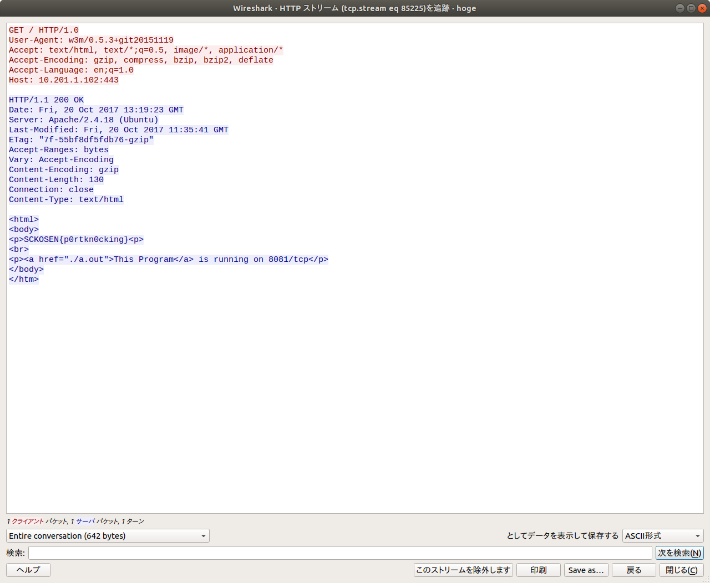

# 通信を解析しろ [KoH / 30pt (Bonus 100pt)]

## Problem

pcapファイルを解析して、隠されたサービスを発見しろ。

[Problem File]

[hoge.pcap](hoge.pcap)

[Server Address]
[http://10.201.1.102](http://10.201.1.102)

## Answer

ボーナス問題解答者: [@Akashi_SN](https://twitter.com/Akashi_SN)

http通信を見るとフラグが書かれてる

`SCKOSEN{p0rtkn0cking}`