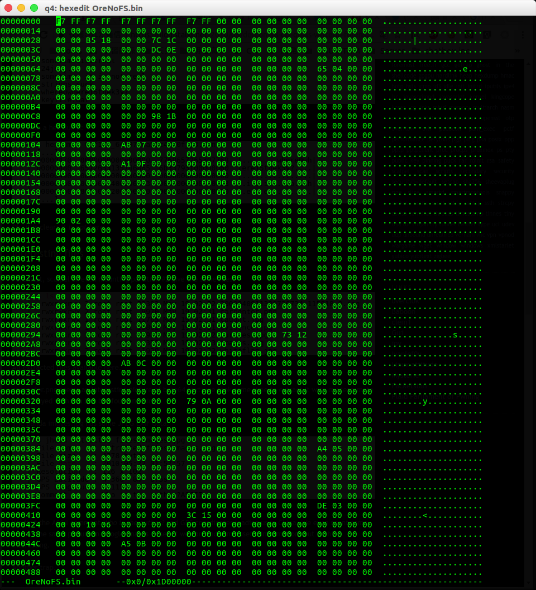
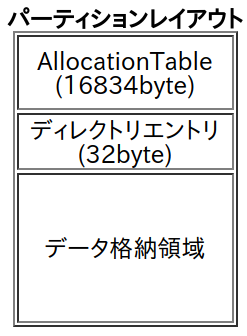

# OreNoFS [Binary / 500 pt]

## Question
このファイル[raw.dmg](raw.dmg)には、どうも独自のファイルシステムが構築されているらしい。
このファイルシステムに格納されたデータは1つ、そのデータを復元しよう。

このファイルシステムは、クラスタ単位で管理されており、1クラスタ=4096byteであることは分かっている。また、AllocationTableというFATファイルシステムでいうFAT領域とディレクトリエントリ、データ格納領域に分けられているようだ。また、GUID Partition Table(GPT)でフォーマットされているので、その分はクラスタの管理外である点に注意しなければならない。
ATは2byte*8192、ディレクトリエントリは32byteで下記の構造体で定義されているらしい。

```c
struct directory_entry {
    unsigned char magic;(1byte)
    char filename[8];
    char extension[3];
    unsigned int size;(4byte)
    unsigned long offset_of_cluster; (2byte)
    char attribute[12];
    unsigned long reserved; (2byte)
};
```

## Answer

回答者: [@sei0o](https://twitter.com/sei0o) 

```bash
$ file raw.dmg 
raw.dmg: DOS/MBR boot sector; partition 1 : ID=0xee, start-CHS (0x3ff,254,63), end-CHS (0x3ff,254,63), startsector 1, 62539 sectors, extended partition table (last)
$ binwalk raw.dmg 

DECIMAL       HEXADECIMAL     DESCRIPTION
--------------------------------------------------------------------------------
7327744       0x6FD000        Zip archive data, at least v2.0 to extract, name: flag.png
26453116      0x193A47C       Zip archive data, at least v1.0 to extract, name: __MACOSX/
26453171      0x193A4B3       Zip archive data, at least v2.0 to extract, name: __MACOSX/._flag.png
26453764      0x193A704       End of Zip archive
```

このファイルシステムの中に`ZIP`があることがわかった

有効なパーティションがあるかを`fdisk`で調べる
> [Forensics入門（CTF）- fdisk](https://qiita.com/knqyf263/items/6ebf06e27be7c48aab2e#fdisk)より

```bash
$ fdisk -lu raw.dmg
Disk raw.dmg: 30.6 MiB, 32020480 bytes, 62540 sectors
Units: sectors of 1 * 512 = 512 bytes
Sector size (logical/physical): 512 bytes / 512 bytes
I/O size (minimum/optimal): 512 bytes / 512 bytes
Disklabel type: gpt
Disk identifier: 99CDF54F-1AF2-416C-99E8-BEFE8FD5296B

デバイス   Start 最後から セクタ Size タイプ
raw.dmg1    2048    61439  59392  29M Microsoft basic data
```

今回は独自のファイルシステムとのことなので更に詳しく調べる

[Autopsy](https://www.sleuthkit.org/autopsy/)とかを作ってるところの[The Sleuth Kit](https://www.sleuthkit.org/sleuthkit/)が詳しく調べられるらしい

> [Forensics入門（CTF）- The Sleuth Kit](https://qiita.com/knqyf263/items/6ebf06e27be7c48aab2e#the-sleuth-kit)より


> [Forensicist - The Sleuth Kit -](https://www.kazamiya.net/SleuthKit)

>先頭文字は具体的には、ディスク(disk)、イメージ(img)、ボリューム(mm)、ファイルシステム(fs)、ファイルネーム(f)、メタデータ(i)、コンテンツ(blk)、ジャーナル(j)があります。
>その後に続く名称としては、内容出力(cat)、統計情報出力(stat)、リスティング(ls)、検索(find)があります。

今回は`mmls`コマンドを使う

> [mmls - Forensicist](https://www.kazamiya.net/Sleuthkit/mmls)

>mmls - ボリュームシステム(パーティションテーブル)のパーティションレイアウト情報を表示する
>mmls'はLinuxの'fdisk -lu'と若干異なるがよく似ている。すなわち、隠しデータを探すためにどのセクタが使用されていないかを表示する。
また、ddでより簡単にパーティションを抽出できるように長さも与えられる。

自動検出を使ってみる

```bash
$ mmls raw.dmg        
GUID Partition Table (EFI)
Offset Sector: 0
Units are in 512-byte sectors

      Slot      Start        End          Length       Description
000:  Meta      0000000000   0000000000   0000000001   Safety Table
001:  -------   0000000000   0000002047   0000002048   Unallocated
002:  Meta      0000000001   0000000001   0000000001   GPT Header
003:  Meta      0000000002   0000000033   0000000032   Partition Table
004:  000       0000002048   0000061439   0000059392   disk image
005:  -------   0000061440   0000062539   0000001100   Unallocated
```

今回は
>GUID Partition Table(GPT)でフォーマットされているので、その分はクラスタの管理外である点に注意しなければならない。

とあるので、問題の独自のファイルシステム(OreNoFS)は、`004:  000       0000002048   0000061439   0000059392   disk image`のよう・・・`dd`コマンドで切り出してみよう！


```plain
$ dd if=raw.dmg of=OreNoFS.bin skip=2048 bs=512 count=59392
59392+0 レコード入力
59392+0 レコード出力
30408704 bytes (30 MB, 29 MiB) copied, 0.157168 s, 193 MB/s
```

バイナリエディタで開いてみる

```bash
$ hexedit OreNoFS.bin
```



`0`がたくさん・・・

> このファイルシステムは、クラスタ単位で管理されており、1クラスタ=4096byteであることは分かっている。また、AllocationTableというFATファイルシステムでいうFAT領域とディレクトリエントリ、データ格納領域に分けられているようだ。
ATは2byte*8192、ディレクトリエントリは32byteで下記の構造体で定義されているらしい。

問題文より、



> [FATファイルシステムの構造](http://resove.cool.coocan.jp/fatKnowledge/fatStructure.html) 参考

こんな感じのパーティションレイアウトになっているよう

```plain
4 * 4096 = 16384 byte   // AllocationTable
32 byte                 // ディレクトリエントリ
16384 + 32 = 16416 byte // データ格納領域の先頭
```

`AllocationTable`を切り出す

```plain
dd if=OreNoFS.bin of=OreNoFS_AT.bin bs=4096 count=4
4+0 レコード入力
4+0 レコード出力
16384 bytes (16 kB, 16 KiB) copied, 8.9036e-05 s, 184 MB/s
```

`ディレクトリエントリ`を切り出してみる

```plain
$ dd if=OreNoFS.bin of=OreNoFS_DE.bin skip=16384 bs=1 count=32
32+0 レコード入力
32+0 レコード出力
32 bytes copied, 0.000353063 s, 90.6 kB/s
```

同様に`データ格納領域`も切り出してみる

まずブロックサイズを計算

```plain
16416 = 513 * 32
```

切り出し！

```plain
$ dd if=OreNoFS.bin of=OreNoFS_DT.bin skip=513 ibs=32
949759+0 レコード入力
59359+1 レコード出力
30392288 bytes (30 MB, 29 MiB) copied, 0.357394 s, 85.0 MB/s
```

`ディレクトリエントリ`をバイナリ表示してみる

```bash
$ cat OreNoFS_DE.bin | hexdump -C
00000000  0f 66 6c 61 67 2e 7a 69  70 00 00 00 1a e7 0f 00  |.flag.zip.......|
00000010  fd 05 00 00 00 00 00 00  00 00 00 00 00 00 ff 00  |................|
00000020

```

問題文にあった構造体と比べてみる

```c
struct directory_entry {
    unsigned char magic;(1byte)
    char filename[8];
    char extension[3];
    unsigned int size;(4byte)
    unsigned long offset_of_cluster; (2byte)
    char attribute[12];
    unsigned long reserved; (2byte)
};
```

当てはめてみると、

```c
unsigned char magic = 0x0f;
char filename[8] = 0x66 0x6c 0x61 0x67 0x2e 0x7a 0x69 0x70;
char extension[3] = 0x00 0x00 0x00;
unsigned int size; = 0x1a 0xe7 0x0f 0x00;
unsigned long offset_of_cluster = 0xfd 0x05;
char attribute[12] = 0x00 0x00 0x00 0x00 0x00 0x00 0x00 0x00 0x00 0x00 0x00 0x00;
unsigned long reserved = 0xff 0x00;
```

いい感じに当てはまった！

>また、AllocationTableというFATファイルシステムでいうFAT領域

とあるのでとりあえず`FAT`に当てはめてやると

> [FATファイル システムのしくみと操作法](http://elm-chan.org/docs/fat.html#fat_determination)

>- クラスタ数4085以下のボリュームはFAT12である。

>- クラスタ数4086以上、65525以下のボリュームはFAT16である。

>- クラスタ数65526以上のボリュームはFAT32である。

このファイルは`30408704`バイトでクラスタサイズは`4096`バイトなので、`30408704÷4096 = 7424`クラスタとなる

よって無理やり当てはめると、`FAT16`となる

アロケーションテーブルには各クラスタが使えるかどうかが書かれていて,`FAT16`で`0xFFF7`は不良クラスタを表してるそう

それ以外(`0x0002:0xFFF6`)は使用中クラスタ (値は次のクラスタ番号)を表してるらしい

> [FATファイル システムのしくみと操作法](http://elm-chan.org/docs/fat.html#file_cluster)


```python

```