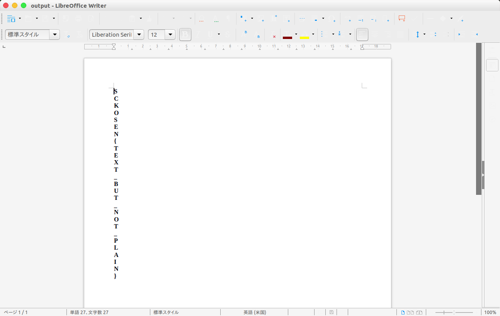

# 簡単な符号化2 [Crypto / 100pt]

## Question
ファイルからフラグを探せ

[Problem File]

[https://score.kosensc2017.tech/contents/problem/6/binary](binary)

## Answer

解答者: [@sei0o](https://twitter.com/sei0o)

```bash
$ cat binary 
NGI1MDA0MDMwMDE0MDgwODAwMDgyYzU2NGI1MzAwMDAwMDAwMDAwMDAwMDAwMDAw
MDAwMDAwMGIwMDAwNzI1ZjZjNjUyZjczNzIyZTZjNjVhZDczZGQ5MjAzNGEwYzQx
ZWY4NTE0ZmJlZTQzZDliYjEwNTY5ZDkxOGRlZGJkMDh (省略)
```

`Base64`のようなのでデコードする

```bash
$ cat binary | base64 -d
4b5004030014080800082c564b53000000000000000000000000000b0000725f6c652f73722e6c65ad73dd92034a0c41ef8514fbee43d9bb10569d918dedbd08a913100fb26643bb3f3b46646fad20ef2e8a4594cbc127247ce77484b3bba93f961762ecb0d05a691c50b44c8c2e9e1af70e (省略)
```

よく見ると`0~f`までしかないので16進数だとわかる

さらに、最初の`4b50`が[ZIPファイルのシグネチャ]("https://ja.wikipedia.org/wiki/ZIP_(%E3%83%95%E3%82%A1%E3%82%A4%E3%83%AB%E3%83%95%E3%82%A9%E3%83%BC%E3%83%9E%E3%83%83%E3%83%88)#.E3.83.95.E3.82.A1.E3.82.A4.E3.83.AB.E3.83.98.E3.83.83.E3.83.80")の`504B`の[ミドルエンディアン](https://ja.wikipedia.org/wiki/%E3%82%A8%E3%83%B3%E3%83%87%E3%82%A3%E3%82%A2%E3%83%B3#.E3.83.9F.E3.83.89.E3.83.AB.E3.82.A8.E3.83.B3.E3.83.87.E3.82.A3.E3.82.A2.E3.83.B3)になっていることがわかる

16進数文字列をバイト列に変換して、それをミドルエンディアンに変換すれば良さそうなので、Python3で書いてみる

[q5.py](q5.py)

```python
#!/usr/bin/env python3
import base64

file = open("binary","rt").read()
str_hex = base64.b64decode(file.encode('utf-8')).decode('utf-8')

hex_list = [int(i+j,16) for (i,j) in zip(str_hex[::2],str_hex[1::2])]

for i in range(0,len(hex_list)-1,2):
    hex_list[i] ,hex_list[i+1] =  hex_list[i+1] , hex_list[i]
 
data = bytes(hex_list)

wf = open("output","wb").write(data)
```

出てきた`output`を`file`コマンドにかけると

```bash
$ file output 
output: Microsoft Word 2007+
```

Wordのようなので開いてみる



縦書きになってた

`SCKOSEN{TEXT_BUT_NOT_PLAIN}`
