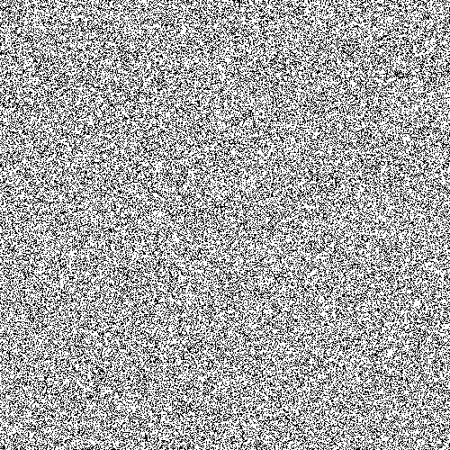
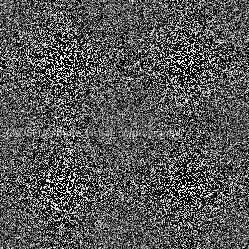
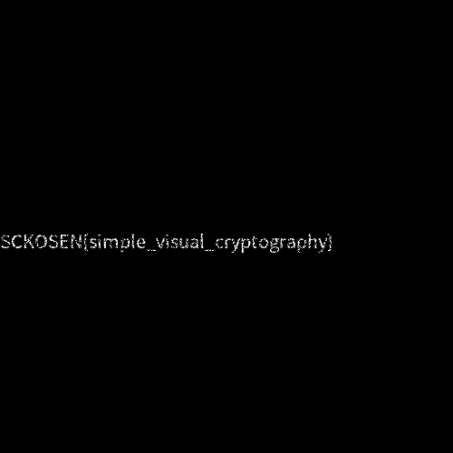

# 解凍して解答せよ [Crypto / 100pt]

## Quesion

ファイルからフラグを読み取れ！

[Problem File]

[https://score.kosensc2017.tech/contents/problem/7/flag.zip](flag.zip)

## Answer

解答者: [@Snow_Poijio](https://twitter.com/Snow_Poijio)

```bash
$ file flag.zip 
flag.zip: Zip archive data, at least v2.0 to extract
$ binwalk flag.zip 

DECIMAL       HEXADECIMAL     DESCRIPTION
--------------------------------------------------------------------------------
0             0x0             Zip archive data, at least v2.0 to extract, compressed size: 86209, uncompressed size: 86209, name: xor.png
86246         0x150E6         Zip archive data, at least v2.0 to extract, compressed size: 77962, uncompressed size: 77962, name: masks.png
164355        0x28203         End of Zip archive
$ unzip flag.zip 
Archive:  flag.zip
 extracting: xor.png                 
 extracting: masks.png
```





この２つのPNGが渡される

ファイル名からこれは２つの画像を重ねると文字が出てくるやつだ〜

`GIMP`で`xor.png`、`masks.png`の順に重ねるとフラグが出てくる



`SCKOSEN{simple_visual_cryptography}`